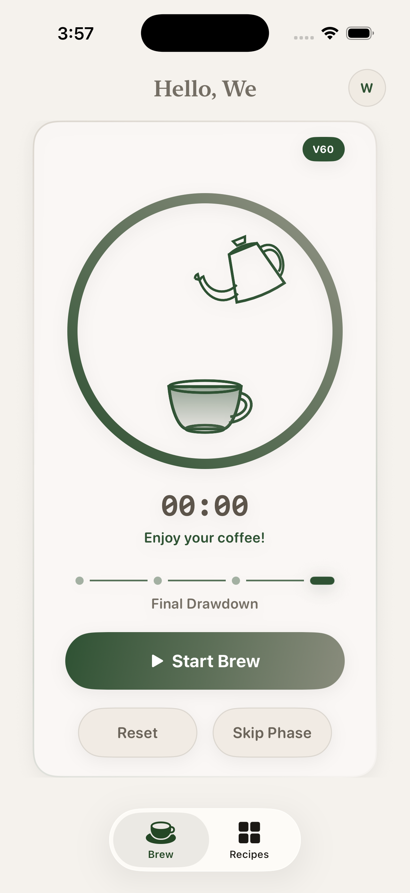
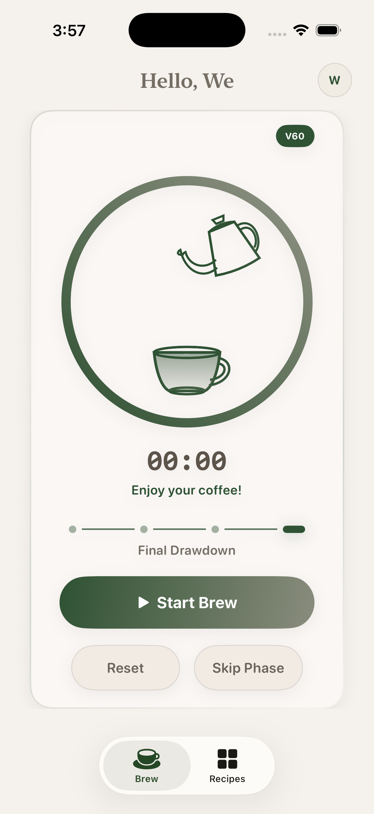

# Brew Sixty

Brew Sixty is a premium-feeling coffee brewing companion for iPhone. It helps you build recipes, save presets, and run calm step-by-step brew timers for V60, Chemex, French Press, and Aeropress.

The app is built with **SwiftUI** and **SwiftData**, stores data locally on-device, and runs fully offline with no backend or paid service required.

## Screenshots

<table>
  <tr>
    <td align="center"><strong>Live Brew Timer</strong></td>
    <td align="center"><strong>Recipes Library</strong></td>
    <td align="center"><strong>Beginner Recipe Builder</strong></td>
  </tr>
  <tr>
    <td></td>
    <td></td>
    <td></td>
  </tr>
</table>

## What the App Does

- **Live brew screen** with a 3-second start countdown, phase stepper, per-phase timer, and clean passive wait states
- **Recipe builder** with beginner-friendly presets like **Cup Size** and **Taste Style**
- **Experience-aware setup** with simpler language and live taste hints for newer brewers, plus technical labels for comfortable users
- **Recipes library** for saving, editing, reusing, and instantly brewing presets
- **One-off brewing** so you can start a brew immediately without saving it first
- **Profile setup** for your name, experience level, and preferred brew methods
- **Siri Shortcuts & App Intents** for hands-free voice commands to filter saved templates or adjust draft parameters (e.g. stronger/lighter, extend bloom, scale cups)
- **Live Activities & Dynamic Island** integration to track remaining step durations and target weight metrics from the lock screen or status bar
- **Minimalist Nordic Light Styling** with a clean light sand background, pine green indicators, and soft birch gray panel cards

## Supported Brew Methods

- V60
- Chemex
- French Press
- Aeropress

## Tech Stack

- SwiftUI
- SwiftData
- Xcode project-based app
- No third-party package dependencies

## Requirements

- **Mac** with Xcode installed
- **Xcode 26.4.1+** recommended
- **iOS 26.4+** simulator or device based on the current project deployment target
- An Apple ID if you want to run the app on a physical iPhone

## Quick Start

### Run in the Simulator

```bash
git clone https://github.com/charugupta-dev/brew_sixty.git
cd brew_sixty
open brew_sixty.xcodeproj
```

Then in Xcode:

1. Select the **brew_sixty** scheme.
2. Choose an iPhone simulator.
3. Press **Run** (`Cmd+R`).

### Build from Terminal

From the repository root:

```bash
xcodebuild -project brew_sixty.xcodeproj -scheme brew_sixty -destination 'generic/platform=iOS Simulator' build
```

## Install on a Real iPhone for Free

If you want to install the app on your own iPhone without paying for Apple Developer Program membership, the simplest route is to run it from Xcode with your personal Apple ID.

1. Clone the repo and open `brew_sixty.xcodeproj`.
2. Connect your iPhone to your Mac.
3. In Xcode, select the **brew_sixty** target.
4. Open **Signing & Capabilities**.
5. Choose your own **Team**.
6. If Xcode reports a signing or identifier conflict, change the bundle identifier to a unique value such as:

```text
com.yourname.brewsixty
```

7. Make sure **Automatically manage signing** is enabled.
8. Choose your iPhone as the run destination.
9. Press **Run** (`Cmd+R`).

## How Updates Work

Because this repository does not ship through the App Store or TestFlight, updates are source-based.

To get the latest version:

```bash
git pull origin main
```

Then reopen the project in Xcode and run it again on the simulator or device.

## Project Structure

```text
brew_sixty/
├── brew_sixty/           # App source
├── brew_sixty.xcodeproj  # Xcode project
├── brew_sixtyTests/      # Unit tests
├── brew_sixtyUITests/    # UI tests
└── docs/                 # Supporting docs/assets
```

## Main Product Flow

### Brew

- runs live brew sessions with phase-by-phase timing
- supports countdown, bloom, steep, press, and drawdown flows depending on method
- shows clear current-step guidance without forcing recipe saving first

### Recipes

- shows saved recipes as the primary library view
- opens a focused recipe composer for creating or editing brews
- supports beginner presets, manual fine-tuning, and direct brew start from the editor

## Data and Privacy

- recipes and brew data are stored locally on-device
- no account is required
- no backend service is required

## Contributing

If you want to contribute:

1. Fork the repository.
2. Create a feature branch.
3. Make your changes.
4. Open a pull request with a clear summary and screenshots if the UI changed.
