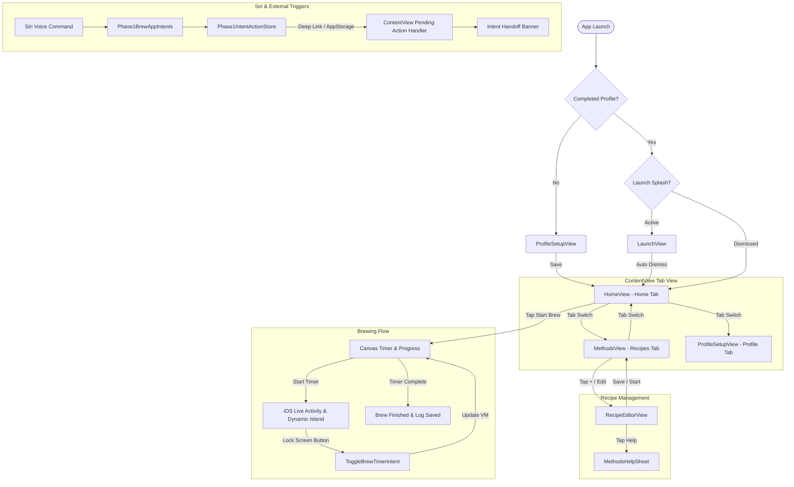

# Brew Sixty — App Flow & User Experience Guide

> **Target Audience**: Software Engineers, Product Managers, and new team members joining the `brew_sixty` project.
> **Purpose**: This document is the single source of truth for the complete end-to-end user flow, screen transitions, state management, experience levels, and feature interactions in `brew_sixty`.

---

## 1. Executive Overview & Product Purpose

**Brew Sixty** is a premium iOS application designed to elevate the home coffee brewing experience (specifically focusing on pour-over methods like the V60, Chemex, French Press, and Aeropress). 

The app blends **tactile manual control** with **smart guidance**, allowing users to:
1. Master precision pour-over ratios, grind sizes, water temperatures, and step timings.
2. Receive adaptive, local rule-based recommendations ("Smart Suggestions") tailored to their experience level.
3. Track active brews with hardware-accelerated circular Canvas animations.
4. Monitor and control live brews outside the app via **iOS Live Activities**, **Dynamic Island**, and **Lock Screen Widgets**.
5. Trigger brews, adjust recipes, or filter methods hands-free using **Siri & Apple App Intents**.

---

## 2. Core User Personas & Experience Levels

The app dynamically adjusts its UI density, terminology, and defaults based on the user's experience level stored in `ProfilePreferences`:

```
┌─────────────────────────────────────────────────────────────────────────┐
│                        Profile Experience Level                         │
└─────────────────────────────────────────────────────────────────────────┘
        │
        ├──► 1. Just Starting (Beginner)
        │    • UI Focus: Simplicity, single-cup defaults, guided starter profiles.
        │    • Terminology: Simple labels ("Coffee & Water", "Strength").
        │    • Guidance: Automatic ratio calculation (e.g. 1:16), beginner hints.
        │
        ├──► 2. Comfortable (Intermediate)
        │    • UI Focus: Moderate flexibility, ratio sliders, custom steep/bloom times.
        │    • Terminology: "Dose & Yield", "Pre-Infusion", "Drawdown".
        │    • Guidance: Comparative hints against saved presets and history logs.
        │
        └──► 3. Enthusiast (Advanced / Professional)
             • UI Focus: Full manual control over grams, precise ratios (1:8 to 1:22),
             •           custom phase timings, temperature tuning, raw recipe tweaks.
             • Guidance: Advanced ratio step analytics and historical variance scoring.
```

---

## 3. App Architecture & Navigation Structure

`brew_sixty` uses a clean 3-tab navigation structure managed by `ContentView.swift`. The primary navigation hierarchy is outlined below:

```
┌─────────────────────────────────────────────────────────────────────────┐
│                           brew_sixtyApp.swift                           │
│                 (ModelContainer: BrewLog, BrewTemplate)                 │
└────────────────────────────────────┬────────────────────────────────────┘
                                     │
                                     ▼
┌─────────────────────────────────────────────────────────────────────────┐
│                            ContentView.swift                            │
│                 (Main Tab Controller & Siri Action Bridge)              │
└──────┬─────────────────────────────┼─────────────────────────────┬──────┘
       │                             │                             │
       ▼                             ▼                             ▼
┌──────────────┐              ┌──────────────┐              ┌──────────────┐
│   Home Tab   │              │ Recipes Tab  │              │ Profile Tab  │
│ (HomeView)   │              │(MethodsView) │              │(ProfileSetup)│
└──────────────┘              └──────────────┘              └──────────────┘
```

### Screen Flow & Transition Diagram



---

## 4. End-to-End Screen Flow Breakdown

### Screen 1: Home Dashboard & Timer (`HomeView.swift`)

The Home Tab is the central operational hub for brewing and tracking intake.

```
┌──────────────────────────────────────────────────────────┐
│  Coffee Intake Today                              [1/2]  │
│  ┌───┐ ┌───┐ ┌───┐ ┌───┐ ┌───┐ ┌───┐ ┌───┐                │
│  │   │ │   │ │█  │ │   │ │   │ │   │ │   │  480ml Total   │
│  └───┘ └───┘ └───┘ └───┘ └───┘ └───┘ └───┘                │
├──────────────────────────────────────────────────────────┤
│                       CANVAS TIMER                       │
│                        ┌───────┐                         │
│                        │ 01:45 │  (Pouring Animation)    │
│                        └───────┘                         │
│             Phase: Bloom (45s) • Target: 50g             │
│            [  Pause  ]      [ Skip Phase ]               │
├──────────────────────────────────────────────────────────┤
│  SMART SUGGESTIONS                                       │
│  [💡 "You usually choose Balanced for V60"]               │
└──────────────────────────────────────────────────────────┘
```

1. **Intake Analytics Header**: Displays a weekly bar chart of coffee consumption built with **Swift Charts**. Shows total bean weight (grams) and fluid volume (ml) consumed today.
2. **Timer & Canvas Renderer**:
   - **Idle State**: Allows selecting coffee weight (via `SteppedWeightPicker`) and ratio (via `PrecisionSlider`), showing calculated water output.
   - **Active State**: Displays a real-time circular canvas animation. The animation features a tilting gooseneck kettle, animated water stream, rising coffee level, and liquid surface waves.
   - **Phase Controls**: Shows phase step titles ("Bloom", "First Pour", "Drawdown"), countdown timer, target water weight, and control buttons (Start, Pause, Resume, Reset, Skip Phase).
3. **Smart Suggestions Carousel**: Displays context-aware cards generated by `BrewRecommendationEngine.swift` based on past brew logs and templates.
4. **Log Persistence**: When a brew finishes, `HomeBrewViewModel` invokes `onBrewComplete`, automatically inserting a new `BrewLog` entry into SwiftData.

---

### Screen 2: Recipe Management & Methods (`MethodsView.swift`)

The Recipes Tab manages all saved brew templates and provides method-based filtering.

```
┌──────────────────────────────────────────────────────────┐
│  Recipes                                                 │
│  [ Filter: V60  (x) ]                                    │
│                                                          │
│  ┌────────────────────────────────────────────────────┐  │
│  │  Morning Ritual V60                                │  │
│  │  18g  •  1:15  •  93°C                             │  │
│  │  [  Brew  ]                       [  Edit  ]       │  │
│  └────────────────────────────────────────────────────┘  │
│                                                          │
│                                                    (+)   │
└──────────────────────────────────────────────────────────┘
```

1. **Method Filter Bar**: Selecting a method filter pill (e.g. V60) filters the template list instantly. Tapping the "xmark" badge clears the filter.
2. **Recipe Template Cards (`RecipeTemplateCard`)**:
   - Shows recipe name, method badge, dose (grams), ratio (or water volume), and temperature (°C).
   - **Brew Button**: Starts the brew immediately by transferring the template into `BrewSessionStore` and switching tabs to `.brew`.
   - **Edit Button**: Opens the `RecipeEditorView` sheet initialized in `.edit(template)` mode.
   - **Swipe to Delete**: Destroys the template from SwiftData and cleans up any persistent brew states in `BrewSessionStore`.
3. **Floating Action Button (+)**: Opens `RecipeEditorView` in `.create` mode.
4. **Intent Handoff Banner**: If the app was opened via Siri or Shortcuts, a sleek banner glides down from the top confirming the triggered intent (e.g., *"Opened V60 recipes"*).

---

### Screen 3: Recipe Composer & Editor (`RecipeEditorView.swift`)

The Recipe Editor allows creating or modifying recipes with interactive controls.

```
┌──────────────────────────────────────────────────────────┐
│  Cancel                                        Save      │
│  CHOOSE BREWER                                           │
│  [ V60 ]   [ Chemex ]   [ Aeropress ]   [ French Press ] │
│                                                          │
│  COFFEE & WATER                                          │
│  Bean Weight                                    18g      │
│  < ─── [-] ─────────────── 18.0g ─────────────── [+] ─── >│
│                                                          │
│  Water Ratio                                   1:15      │
│  └───┴───┴───┴───[  |  ]───┴───┴───┴───┘                 │
│                                                          │
│  RECIPE NAME                                             │
│  [ Morning Ritual V60                         ]          │
│                                                          │
│  [       START BREWING       ]  [    SAVE RECIPE    ]    │
└──────────────────────────────────────────────────────────┘
```

1. **Brewer Selection Grid**: Toggle between V60, Chemex, Aeropress, and French Press. Selecting a brewer updates default timings, ratios, and available parameters dynamically.
2. **Serving Size & Taste Style Selectors**: Quick starter profile pills ("1 Cup", "2 Cups", "Balanced", "Stronger", "Lighter") that recalculate dose and yield on the fly.
3. **Form Input Components**:
   - **Bean Weight**: Adjusted using `SteppedWeightPicker` (a tactile pill stepper with `-` and `+` buttons).
   - **Water Ratio / Volume**: Adjusted using `PrecisionSlider`.
   - **Timings (Bloom, Steep, Press)**: Adjusted using precision sliders mapped to `AppConstants.Methods.Ranges`.
   - **Water Temperature**: Adjusted using `RulerPicker` (a tick-mark ruler control).
4. **Help Sheets (`MethodsHelpSheet`)**: Tapping the `(i)` info icon next to any parameter opens a modal explaining what that variable controls and how to dial it in.
5. **Action Buttons**:
   - **Start Brewing**: Starts a transient brew without saving to templates.
   - **Save Recipe**: Validates inputs and inserts/updates the `BrewTemplate` in SwiftData.

---

### Screen 4: Profile & Preferences (`ProfileSetupView.swift`)

Controls global defaults and user onboarding preferences.

1. **Experience Level Selector**: Choose between *Just Starting*, *Comfortable*, and *Enthusiast*.
2. **Default Recipe Parameters**: Set global default bean weight (grams) and default brew ratio.
3. **Preferred Methods**: Select favorite coffee methods to customize dashboard suggestions.

---

## 5. Live Activity & External Integration Flow

`brew_sixty` integrates deeply with iOS system UI components via `ActivityKit`, `WidgetKit`, and `AppIntents`:

```
┌─────────────────────────────────────────────────────────────────────────┐
│                      Active Timer in HomeBrewViewModel                  │
└────────────────────────────────────┬────────────────────────────────────┘
                                     │
                        (Starts Timer & Phase Dates)
                                     │
                                     ▼
┌─────────────────────────────────────────────────────────────────────────┐
│                       LiveActivityManager.swift                         │
│             (ActivityKit: BrewActivityAttributes.ContentState)          │
└──────────────┬───────────────────────────────────────────┬──────────────┘
               │                                           │
               ▼                                           ▼
┌──────────────────────────────┐            ┌──────────────────────────────┐
│    Dynamic Island Widget     │            │    Lock Screen Banner        │
│ (BrewActivityWidgetView)     │            │ (BrewActivityWidgetView)     │
│  • Compact Leading (Icon)    │            │  • Large Countdown Timer     │
│  • Compact Trailing (Timer)  │            │  • Interactive Pause/Resume  │
│  • Expanded View (Controls)  │            │  • Hardware Progress Bar     │
└──────────────┬───────────────┘            └──────────────┬───────────────┘
               │                                           │
               └─────────────────────┬─────────────────────┘
                                     │
                        (User Taps Pause Button)
                                     │
                                     ▼
┌─────────────────────────────────────────────────────────────────────────┐
│                       ToggleBrewTimerIntent.swift                       │
│                        (Conforms to LiveActivityIntent)                 │
└────────────────────────────────────┬────────────────────────────────────┘
                                     │
                 (Calls BrewSessionStore.shared.activeBrewViewModel)
                                     │
                                     ▼
┌─────────────────────────────────────────────────────────────────────────┐
│                     HomeBrewViewModel.toggleTimer()                     │
│                (Pauses/Resumes Brew & Updates Live Activity)            │
└─────────────────────────────────────────────────────────────────────────┘
```

---

## 6. Summary of Key User Journeys

| Journey | User Action | System Execution | Final Output |
| :--- | :--- | :--- | :--- |
| **Quick Brew from Saved Recipe** | Taps "Brew" on V60 template card in Recipes Tab. | `BrewSessionStore.startSavedTemplate()` transfers template to `HomeBrewViewModel`, switches tab to `.brew`, starts timer and Live Activity. | Timer canvas animates, Dynamic Island launches, Live Activity shows countdown. |
| **Voice Brew via Siri** | Speaks *"Start a V60 brew in Brew Sixty"*. | Siri triggers `StartBrewIntent` -> `Phase1IntentExecutionService` builds transient `RecipeDraft` -> Opens app -> `ContentView` processes `pendingActionData`. | App opens on Home tab with active V60 timer running and Intent Handoff Banner displayed. |
| **Adjust Recipe via Siri** | Speaks *"Make this stronger in Brew Sixty"*. | Siri triggers `AdjustRecipeIntent` -> `RecipeDraft.applyAdjustment(.stronger)` increases dose by +1.5g. | Active draft in `RecipeEditorView` or `BrewSessionStore` updates dynamically. |
| **Pause from Lock Screen** | Taps Pause button on Lock Screen Live Activity. | iOS invokes `ToggleBrewTimerIntent.perform()` in background -> fetches `BrewSessionStore.shared.activeBrewViewModel` -> calls `toggleTimer()`. | Timer pauses, progress freezes, button changes to Play icon on Lock Screen. |
| **Lock Screen Timer Completion** | Screen locks while timer is running. | `HomeBrewViewModel` holds a `UIBackgroundTaskIdentifier` keeping execution alive in background -> timer reaches total duration -> saves `BrewLog` to SwiftData -> ends Live Activity. | Live Activity displays "Done!" and cleanly dismisses after delay; log recorded in history. |

---
*Documentation built for Brew Sixty codebase v1.0. Preserved for team onboarding and reference.*
