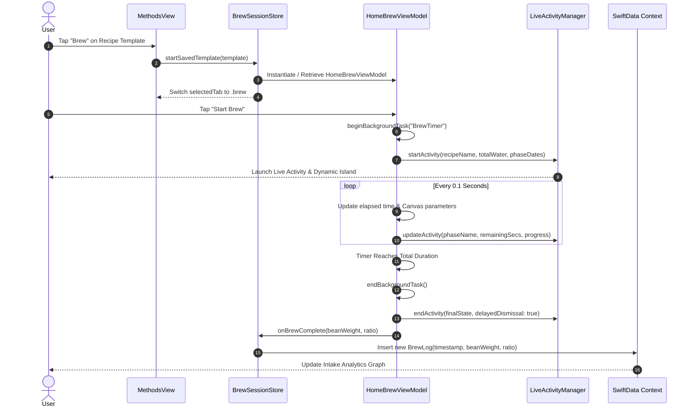
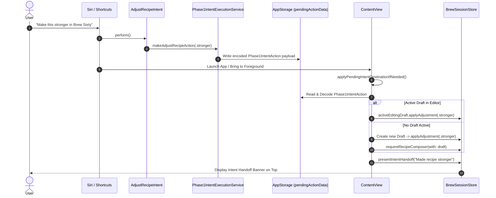

# Brew Sixty — Technical Architecture, Codebase & Data Flow Guide

> **Target Audience**: Software Engineers, Technical Leads, and System Architects working on `brew_sixty`.
> **Purpose**: This document serves as the technical source of truth for the codebase architecture, file-by-file directory, function definitions, data flow pipelines, state mutation cycles, and SwiftData persistence mechanisms.

---

## 1. High-Level Architecture Overview

`brew_sixty` is built with modern **SwiftUI**, **SwiftData**, and Apple's **`@Observable` Macro** (introduced in iOS 17). It adopts a decoupled **MVVM + Centralized Session Store** pattern.

```
┌───────────────────────────────────────────────────────────────────────────────────────────┐
│                                    SWIFTDATA LAYER                                        │
│               [ModelContainer]  ◄──────►  [ModelContext (mainContext)]                    │
│                        │                                   │                              │
│                        ▼                                   ▼                              │
│                  (BrewTemplate)                         (BrewLog)                         │
└────────────────────────┬───────────────────────────────────┬──────────────────────────────┘
                         │                                   │
                         ▼                                   ▼
┌───────────────────────────────────────────────────────────────────────────────────────────┐
│                                   SHARED STORE & STATE                                    │
│                       BrewSessionStore (Shared MainActor Singleton)                       │
│        • activeBrewViewModel: HomeBrewViewModel?                                          │
│        • transientBrews: [HomeBrewViewModel]                                              │
│        • activeEditingDraft: RecipeDraft?                                                 │
│        • intentHandoffBanner: IntentHandoffBanner?                                       │
└────────────────────────┬───────────────────────────────────┬──────────────────────────────┘
                         │                                   │
                         ▼                                   ▼
┌───────────────────────────────────────────────────┐  ┌────────────────────────────────────┐
│                    VIEW LAYER                     │  │          EXTERNAL / SYSTEM         │
│  • ContentView (Root & Action Dispatcher)         │  │  • ActivityKit (LiveActivityMgr)   │
│  • HomeView (Dashboard, Canvas Timer, Swift Charts)│  │  • AppIntents (Voice & Siri)       │
│  • MethodsView (Template Cards & Filter Bar)      │  │  • LiveActivityIntent (WidgetKit)  │
│  • RecipeEditorView (Draft Adjuster & Builder)    │  │  • UIBackgroundTaskIdentifier      │
└───────────────────────────────────────────────────┘  └────────────────────────────────────┘
```

---

## 2. File-by-File Technical Directory

Below is the complete reference of every source file in the `brew_sixty` project codebase:

### 2.1 Core App Entry & Root

#### 1. [brew_sixtyApp.swift](file:///Users/charu/brew_sixty/brew_sixty/brew_sixty/brew_sixtyApp.swift)
- **Role**: Application Entry Point (`@main`).
- **Key Responsibilities**:
  - Initializes the SwiftData `sharedModelContainer` for `BrewLog` and `BrewTemplate` entities.
  - Checks `ReadmeCaptureConfiguration.isEnabled` to toggle in-memory testing mode vs persistent SQLite storage.
  - Invokes `ReadmeCaptureConfiguration.seedDemoDataIfNeeded` to populate initial demo recipes if empty.
  - Inject `.modelContainer(sharedModelContainer)` into the root `ContentView`.

#### 2. [ContentView.swift](file:///Users/charu/brew_sixty/brew_sixty/brew_sixty/ContentView.swift)
- **Role**: Root Navigation Controller & System Event Router.
- **Key Responsibilities**:
  - Maintains `selectedTab` state (`enum Tab { case brew, recipes, profile }`).
  - Holds `@State private var brewSessionStore = BrewSessionStore.shared`.
  - Listens to `@AppStorage(Phase1IntentActionStore.key)` for incoming Siri/Shortcut commands.
  - **`applyPendingIntentDestinationIfNeeded()`**: Parses JSON payloads from Siri intents and routes the app to the appropriate tab or triggers recipe draft adjustments inline.
  - Registers `brewSessionStore.onInsertLog` callback to persist logs into SwiftData when a brew finishes.

---

### 2.2 Data Models (`Model/`)

#### 3. [BrewTemplate.swift](file:///Users/charu/brew_sixty/brew_sixty/brew_sixty/Model/BrewTemplate.swift)
- **Role**: SwiftData `@Model` representing a user's saved coffee recipe.
- **Key Properties**:
  - `id: UUID`: Unique primary key.
  - `name: String`: Custom name (e.g. "Morning Ritual V60").
  - `method: BrewMethod`: Enum (`.v60`, `.chemex`, `.frenchPress`, `.aeropress`).
  - `beanWeight: Double`: Coffee dosage in grams.
  - `ratio: Double`: Water ratio (e.g. `15.0` for 1:15).
  - `targetTemperature: Double`: Water temperature in °C.
  - `customBloomDuration / customSteepDuration / customPressDuration`: Optional override durations.
  - `waterVolume: Double`: Computed or stored total water volume in grams.

#### 4. [BrewLog.swift](file:///Users/charu/brew_sixty/brew_sixty/brew_sixty/Model/BrewLog.swift)
- **Role**: SwiftData `@Model` representing a completed brew history record.
- **Key Properties**:
  - `id: UUID`: Unique log identifier.
  - `timestamp: Date`: Exact date and time the brew was completed.
  - `beanWeightGram: Double`: Bean dosage used.
  - `ratio: Double`: Brew ratio used.
  - `thought: String?`: Optional user tasting notes.
  - `waterVolumeGram: Double`: Calculated water volume (`beanWeightGram * ratio`).

#### 5. [RecipeDraft.swift](file:///Users/charu/brew_sixty/brew_sixty/brew_sixty/Model/RecipeDraft.swift)
- **Role**: Dynamic `@Observable` data structure used during recipe composition and Siri adjustments.
- **Key Methods**:
  - **`applyAdjustment(_ type: RecipeAdjustmentType)`**: Mutating state function that adjusts coffee parameters based on intent commands:
    - `.stronger`: Increases coffee dose (`beanWeight += 1.5g`).
    - `.lighter`: Decreases coffee dose (`beanWeight -= 1.5g`).
    - `.oneCup`: Scales recipe to 15g beans (approx 240g water).
    - `.twoCups`: Scales recipe to 30g beans (approx 480g water).
    - `.increaseBloom`: Adds +15 seconds to pre-infusion duration.
    - `.decreaseTemperature`: Lowers water target by -3°C.

#### 6. [BrewMethod.swift](file:///Users/charu/brew_sixty/brew_sixty/brew_sixty/Model/BrewMethod.swift)
- **Role**: Primary Enum for brewing equipment (`V60`, `Chemex`, `French Press`, `Aeropress`). Provides raw values, default ratios, and SF Symbol icon names.

#### 7. [ProfilePreferences.swift](file:///Users/charu/brew_sixty/brew_sixty/brew_sixty/Model/ProfilePreferences.swift)
- **Role**: User default storage keys and `ProfileExperienceLevel` enum (`.justStarting`, `.comfortable`, `.enthusiast`).

#### 8. [AppConstants.swift](file:///Users/charu/brew_sixty/brew_sixty/brew_sixty/Model/AppConstants.swift)
- **Role**: Centralized constant definitions for layout paddings, corner radii, timer intervals (`0.1s`), phase names, and default numeric bounds.

#### 9. [Color+Theme.swift](file:///Users/charu/brew_sixty/brew_sixty/brew_sixty/Model/Color+Theme.swift)
- **Role**: Design system color tokens (`primaryCopper`, `coffeeCream`, `appPanel`, `deepRoastInk`) and custom view modifiers (`.liquidGlassBorder()`, `.premiumCardBackground()`).

---

### 2.3 View Models (`ViewModel/`)

#### 10. [BrewSessionStore.swift](file:///Users/charu/brew_sixty/brew_sixty/brew_sixty/ViewModel/BrewSessionStore.swift)
- **Role**: Centralized MainActor Store Singleton (`BrewSessionStore.shared`).
- **Key Responsibilities**:
  - `static let shared = BrewSessionStore()`: Singleton instance accessible across background intents and UI.
  - `activeBrewViewModel: HomeBrewViewModel?`: Computed property returning the currently running or paused brew session.
  - `activeEditingDraft: RecipeDraft?`: Tracks the draft currently open in `RecipeEditorView` so Siri shortcuts can modify it live.
  - `transientBrews: [HomeBrewViewModel]`: Array of active non-saved brew sessions.
  - `startSavedTemplate(_ template: BrewTemplate)`: Spawns or restores a `HomeBrewViewModel` tied to a template.
  - `presentIntentHandoff(title:subtitle:)`: Displays top feedback banner when Siri executes a command.

#### 11. [HomeBrewViewModel.swift](file:///Users/charu/brew_sixty/brew_sixty/brew_sixty/ViewModel/HomeBrewViewModel.swift)
- **Role**: Main Timer Engine & Canvas Animation Coordinator.
- **Key Responsibilities**:
  - **Timer Execution**: `Timer.scheduledTimer(withTimeInterval: 0.1, repeats: true)` computes exact elapsed time (`Date().timeIntervalSince(startDate)`).
  - **Background Assertions**: Uses `UIBackgroundTaskIdentifier` (`UIApplication.shared.beginBackgroundTask`) inside `startTimer()` to ensure the timer continues ticking when the device screen locks.
  - **Phase Calculation**: Dynamically determines current phase ("Bloom", "Drawdown", "Done"), progress (`0.0` to `1.0`), and water targets.
  - **Live Activity Integration**: Calls `LiveActivityManager.shared.startActivity()`, `updateActivity()`, and `endActivity()` during state transitions.
  - **2D Canvas Parameters**: Exposes animated kettle tilt angles, pour stream width, cup fill height, and wave oscillations.

---

### 2.4 Views (`View/`)

#### 12. [HomeView.swift](file:///Users/charu/brew_sixty/brew_sixty/brew_sixty/View/HomeView.swift)
- **Role**: Home Tab UI displaying daily intake, canvas animation, timer controls, and suggestions.
- **Components**:
  - `intakeHeader`: Swift Charts bar graph for weekly intake.
  - `timerCanvas`: Canvas 2D graphic rendering kettle, water stream, cup level, and liquid waves.
  - `smartSuggestionsSection`: Horizontal scrolling suggestion cards.

#### 13. [MethodsView.swift](file:///Users/charu/brew_sixty/brew_sixty/brew_sixty/View/MethodsView.swift)
- **Role**: Recipe Template Directory & Brewer Filtering.
- **Components**:
  - `methodFilter` pill badge.
  - `RecipeTemplateCard` list with swipe-to-delete.
  - Floating Action Button (+) for recipe creation.

#### 14. [RecipeEditorView.swift](file:///Users/charu/brew_sixty/brew_sixty/brew_sixty/View/RecipeEditorView.swift)
- **Role**: Recipe Builder Sheet.
- **Components**:
  - Syncs `draft` bidirectionally with `brewSessionStore.activeEditingDraft`.
  - Steppers, sliders, ruler pickers, taste profile selectors, and `MethodsHelpSheet`.

---

### 2.5 Support & Systems (`Support/` & `AppIntents/`)

#### 15. [BrewRecommendationEngine.swift](file:///Users/charu/brew_sixty/brew_sixty/brew_sixty/Support/BrewRecommendationEngine.swift)
- **Role**: Pure rule-based engine evaluating `BrewLog` history and active `RecipeDraft` to produce personalized recommendations without an external LLM.

#### 16. [Phase1BrewAppIntents.swift](file:///Users/charu/brew_sixty/brew_sixty/brew_sixty/AppIntents/Phase1BrewAppIntents.swift)
- **Role**: Siri & App Intents Definitions (`StartBrewIntent`, `CreateRecipeIntent`, `AdjustRecipeIntent`, `ShowRecipesIntent`, `BrewSixtyShortcutsProvider`).

#### 17. [Phase1IntentExecutionService.swift](file:///Users/charu/brew_sixty/brew_sixty/brew_sixty/AppIntents/Phase1IntentExecutionService.swift)
- **Role**: Encodes intent parameters into `Phase1IntentAction` structs and writes them to `@AppStorage` for `ContentView` execution.

#### 18. [LiveActivityManager.swift](file:///Users/charu/brew_sixty/brew_sixty/brew_sixty/Support/LiveActivityManager.swift)
- **Role**: Wrapper around `Activity<BrewActivityAttributes>` handling ActivityKit lifecycle.

#### 19. [ToggleBrewTimerIntent.swift](file:///Users/charu/brew_sixty/brew_sixty/brew_sixty/Support/LiveActivity/ToggleBrewTimerIntent.swift)
- **Role**: `LiveActivityIntent` enabling interactive Lock Screen & Dynamic Island Pause/Resume buttons.

#### 20. [Stubs.swift](file:///Users/charu/brew_sixty/brew_sixty/BrewSixtyWidgets/Stubs.swift)
- **Role**: Lightweight stub declarations (`BrewSessionStore`, `HomeBrewViewModel`) compiled *only* in the `BrewSixtyWidgets` extension target to satisfy Xcode compilation without pulling in full main app dependencies.

---

## 3. Detailed Data Flow & Sequence Diagrams

### Sequence 1: Complete Brewing Session & Log Saving



---

### Sequence 2: Voice Command via Siri -> Intent Execution



---

## 4. State Mutation & Binding Matrix

| Source State Property | Holding File | Binding / Consumer | Trigger Function | Purpose |
| :--- | :--- | :--- | :--- | :--- |
| `selectedTab` | `ContentView.swift` | `@Binding` in `HomeView`, `MethodsView`, `RecipeEditorView` | Tab button tap / `startSavedTemplate()` | Controls root screen switching. |
| `activeEditingDraft` | `BrewSessionStore.swift` | `@State private var draft` in `RecipeEditorView` | `.onChange(of: brewSessionStore.activeEditingDraft)` | Allows Siri intents to mutate active draft parameters live. |
| `pendingActionData` | `@AppStorage` | `ContentView.swift` | `applyPendingIntentDestinationIfNeeded()` | Passes intent actions from Siri background thread to main UI thread. |
| `backgroundTaskID` | `HomeBrewViewModel.swift` | `UIApplication.shared` | `beginBackgroundTask()` / `endBackgroundTask()` | Prevents iOS background timer suspension when screen locks. |
| `templates` | `@Query` in SwiftData | `MethodsView.swift`, `RecipeEditorView.swift` | `modelContext.insert()` / `delete()` | Persistent saved recipes database query. |
| `logs` | `@Query` in SwiftData | `HomeView.swift` | `addBrewLog()` | Persistent coffee consumption intake records. |

---
*Technical Architecture Guide built for Brew Sixty codebase v1.0. Source of Truth.*
